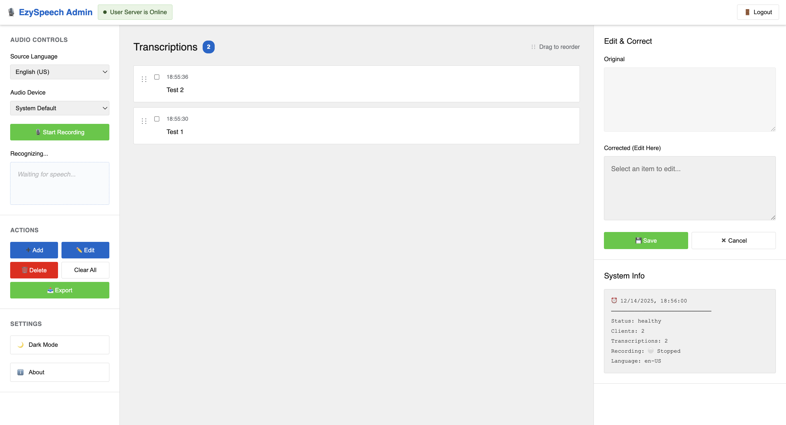
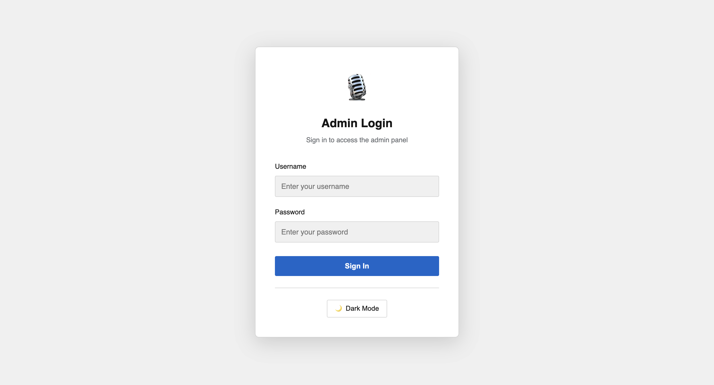
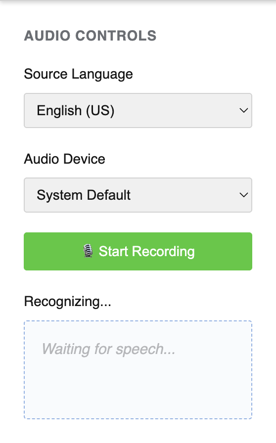
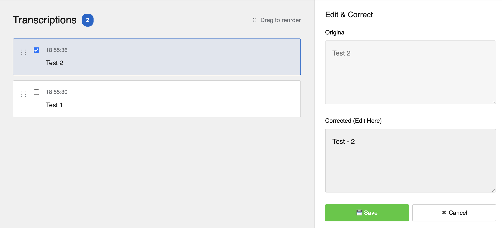
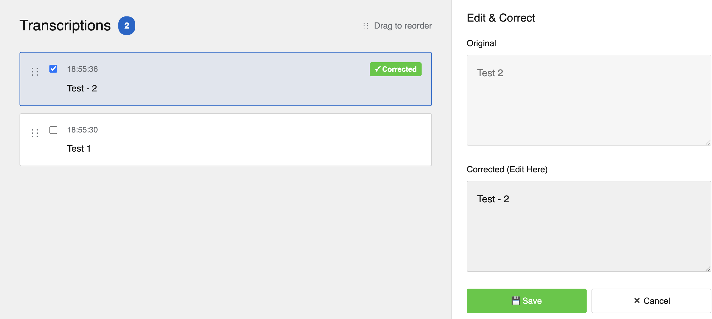
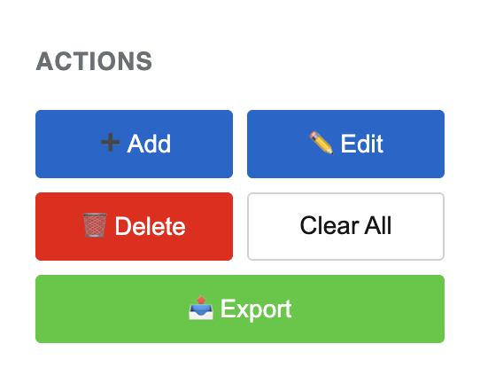
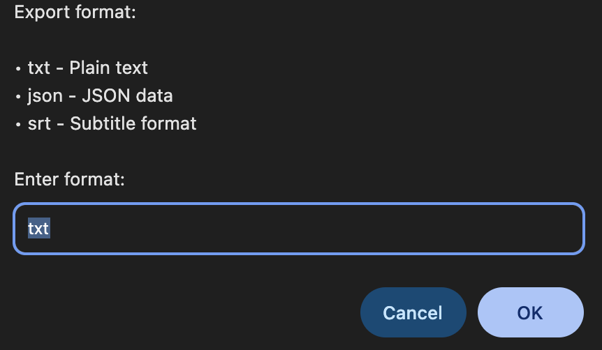
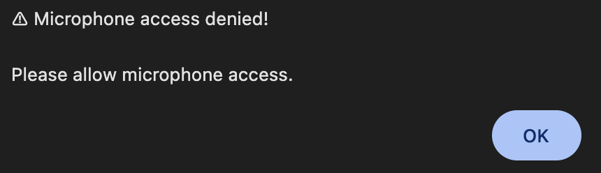

# EzySpeech - Administrator Guide

**Real-Time Speech Translation System for Administrators**

Welcome! This guide will help you set up and use EzySpeechTranslate to provide real-time speech translation services.

---

## 📋 Table of Contents

- [What is EzySpeech?](#what-is-ezyspeech)
- [Quick Start](#quick-start)
- [Using the Admin Interface](#using-the-admin-interface)
- [Best Practices](#best-practices)
- [Troubleshooting](#troubleshooting)
- [Support](#support)

---

## What is EzySpeech?

EzySpeech is a real-time speech recognition and translation system designed for:

- ⛪️ **Religious Services** - Live sermon translation
- 🎓 **Education** - Lecture translation for international students
- 💼 **Business** - Multilingual meeting support
- 🎥 **Live Events** - Real-time subtitles for audiences
- 🏥 **Healthcare** - Doctor-patient communication
- 🎤 **Conferences** - Live interpretation

**Your Role as Administrator:**

- Speak into the microphone or select audio input
- Monitor and correct transcriptions in real-time
- Ensure accurate translations reach your audience

---

## Quick Start

### System Requirements

- **Computer**: Windows, Mac, or Linux
- **Browser**: Google Chrome or Microsoft Edge (recommended)
- **Microphone**: Built-in or external microphone
- **Internet**: Required for translation services

### Installation

Your IT administrator will provide you with:

- ✅ The web address (URL) to access the system
- ✅ Your admin username and password
- ✅ Technical support contact information

**Typical URLs:**

- Admin Interface: `https://your-domain.com:1916`
- Main Server: `https://your-domain.com:1915`

---

## Using the Admin Interface

### 1. Logging In

1. Open your browser (Chrome or Edge)
2. Navigate to the admin URL provided by IT
3. Enter your **username** and **password**
4. Click **Sign In**

**First time?** Contact your IT administrator to receive your credentials.

---

### 2. Starting a Translation Session

#### Step-by-Step:

1. **Select Source Language**
   
   - Choose the language you'll be speaking
   - Options: English, Chinese, Spanish, French, etc.

2. **Select Audio Device**
   
   - Choose your microphone from the dropdown
   - "System Default" usually works fine
   - Test your microphone if unsure

3. **Click "🎙️ Start Recording"**
   
   - Button turns red when active
   - Speak clearly into the microphone
   - System recognizes speech automatically

4. **Speak Naturally**
   
   - No need to pause between sentences
   - System processes in real-time
   - Translations appear automatically for viewers

---

### 3. Monitoring Transcriptions

As you speak, transcriptions appear as cards:

**Each Card Shows:**

- **Original Text** - What the system recognized
- **Corrected Text** - Your edits (if any)

---

### 4. Correcting Transcriptions

**When the system makes a mistake:**

1. **Click on the card** to select it
   
   - Checkbox automatically checks
   - Card highlights

2. **Edit the "Corrected" text field**
   
   - Fix typos, grammar, or misrecognized words
   - Use proper punctuation

3. **Click "💾 Save"**
   
   - Correction broadcasts immediately
   - All viewers see the updated translation
   - Original text preserved for reference

**Tips:**

- ✅ Only correct important errors
- ✅ Fix proper names, numbers, technical terms
- ✅ Improve clarity and grammar
- ❌ Don't over-edit minor variations

---

### 5. Bulk Actions

**Select Multiple Cards:**

- Click checkboxes on multiple cards
- Use bulk action buttons:
  - **Save All** - Apply all corrections at once
  - **Delete** - Remove selected items
  - **Clear All** - Start fresh (use carefully!)

---

### 6. Exporting Transcripts

**Save your session:**

1. Click **"📤 Export"** button
2. Choose format:
   - **TXT** - Simple text file (plain text with timestamps)
   - **JSON** - Structured data (for technical use and data processing)
   - **CSV** - Spreadsheet format (compatible with Excel, Google Sheets)
   - **SRT** - Video subtitle format (for video editing tools like DaVinci, Premiere)
3. File downloads automatically

**Best Practices:**

- Export after each session
- Keep backups for your records
- Use **SRT** for video editing projects
- Use **CSV** for analysis in spreadsheet applications
- Use **JSON** for integration with other systems
- Use **TXT** for simple reference documents

---

## Best Practices

### Audio Setup

**For Best Results:**

- ✅ Use a quality external microphone when possible
- ✅ Position mic 6-12 inches from your mouth
- ✅ Minimize background noise
- ✅ Test audio levels before events
- ✅ Use pop filter for plosive sounds

**Avoid:**

- ❌ Built-in laptop mics in large rooms
- ❌ Speaking too far from microphone
- ❌ Rooms with echo or ambient noise
- ❌ Multiple people talking at once

---

### Speaking Tips

**Optimize Recognition:**

- 🗣️ Speak clearly at moderate pace
- 🗣️ Enunciate important words
- 🗣️ Pause briefly between topics

**During Live Events:**

- Monitor the interface regularly
- Correct critical errors immediately

---

### Session Management

**Before Starting:**

- [ ] Test microphone and audio levels
- [ ] Verify internet connection
- [ ] Confirm audience can see client display
- [ ] Set correct source language

**During Session:**

- [ ] Monitor transcriptions for accuracy
- [ ] Correct errors as they appear
- [ ] Check audience feedback if possible
- [ ] Keep backup recording device

**After Session:**

- [ ] Export transcripts (multiple formats)
- [ ] Clear history if needed for next session
- [ ] Save backups to cloud/external drive
- [ ] Review any problem areas

---

## Troubleshooting

### Cannot Log In

**Problem:** Login fails or shows error

**Solutions:**

1. ✅ Verify username and password (case-sensitive)
2. ✅ Clear browser cache and cookies
3. ✅ Try different browser (Chrome/Edge)
4. ✅ Check with IT administrator for account status
5. ✅ Verify you're using correct URL

---

### Microphone Not Working

**Problem:** No sound detected or "No microphone found"

**Solutions:**

1. ✅ **Allow microphone permissions in browser**
   
   - Click lock icon in address bar
   - Enable microphone permission
   - Refresh page

2. ✅ **Check system settings**
   
   - Windows: Settings > Privacy > Microphone
   - Mac: System Preferences > Security > Microphone
   - Linux: Sound Settings > Input

3. ✅ **Test microphone**
   
   - Try different audio device
   - Verify mic works in other apps
   - Check volume levels

4. ✅ **Browser compatibility**
   
   - Use Chrome or Edge only
   - Update to latest browser version

---

### Transcription Not Appearing

**Problem:** Speaking but nothing appears

**Solutions:**

1. ✅ Check "Start Recording" button is RED (active)
2. ✅ Verify microphone input levels moving
3. ✅ Speak louder or closer to microphone
4. ✅ Check browser console for errors (F12)
5. ✅ Refresh page and try again
6. ✅ Try different source language
7. ✅ Contact your IT

---

### Corrections Not Saving

**Problem:** Edits don't update for viewers

**Solutions:**

1. ✅ Check internet connection
2. ✅ Verify server is running (contact IT)
3. ✅ Click "Save" button after editing
4. ✅ Check browser console for errors (F12)
5. ✅ Refresh and try again

---

### Poor Translation Quality

**Problem:** Translations are inaccurate

**Solutions:**

- Original transcription accurate?
  
  - ✅ Use corrections to improve source text
  - ✅ Speak more clearly
  - ✅ Check source language setting

- Translation wrong even with good source?
  
  - ✅ Internet connection issue (requires Google Translate)
  - ✅ Try alternative phrasing
  - ✅ Contact IT if persistent

---

### Browser Shows "Not Supported"

**Problem:** Page shows compatibility error

**Solutions:**

1. ✅ **Use Chrome or Edge only** - Firefox not supported for recognize
2. ✅ **Update browser** to latest version
3. ✅ **Enable HTTPS** - Site must use secure connection
4. ✅ **Check URL** - Make sure it starts with `https://`

---

## Support

### Getting Help

**During Events:**

- Have IT support on standby
- Keep backup recording device ready
- Document issues for later review

**Technical Support:**

- Contact your IT administrator
- Provide:
  - What you were trying to do
  - Error messages (screenshot)
  - Browser and OS version
  - Time and date of issue

**Self-Help:**

- Check browser console (F12 key)
- Review system logs with IT
- Test in different browser
- Try different network connection

---

## Quick Reference Card

### Essential Controls

| Action          | How To                                                |
| --------------- | ----------------------------------------------------- |
| Start recording | Select language & device, click "🎙️ Start Recording" |
| Stop recording  | Click red "Stop Recording" button                     |
| Correct text    | Click card, edit "Corrected" field, click "💾 Save"   |
| Delete item     | Select card, click "Delete"                           |
| Clear all       | Click "Clear All" (confirmation required)             |
| Export          | Click "📤 Export", choose format                      |
| Logout          | Click "Logout" button                                 |

---

## Additional Resources

- **Technical documentation**: Contact IT administrator
- **User client guide**: For audience members
- **Video tutorials**: Request from IT if available
- **Feedback**: Report issues via IT support

---

**Made with ❤️ for seamless multilingual communication**

*Last Updated: December 2025 | Version 3.3.0*
