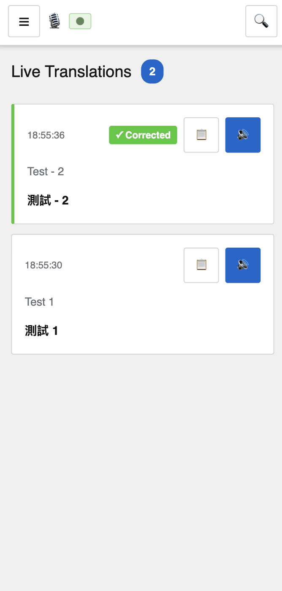
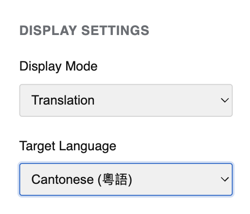
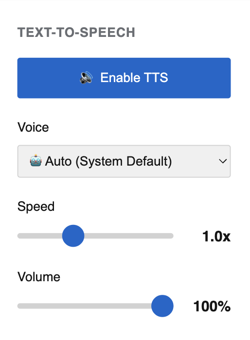
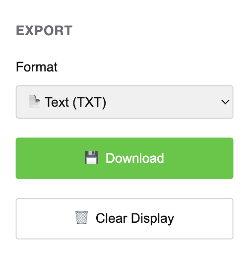

# EzySpeechTranslate - Viewer Guide

**Real-Time Translation Display for Audiences**

Welcome! This guide will help you view live translations during events and services.

---

## 📋 Table of Contents

- [What is EzySpeechTranslate?](#what-is-ezyspeech translate)
- [Getting Started](#getting-started)
- [Using the Viewer Interface](#using-the-viewer-interface)
- [Features](#features)
- [Troubleshooting](#troubleshooting)
- [FAQ](#faq)

---

## What is EzySpeechTranslate?

EzySpeechTranslate provides real-time translation of live speech in multiple languages. Perfect for:

- ⛪️ Religious services and sermons
- 🎓 Educational lectures
- 💼 Business presentations
- 🎤 Conferences and events
- 🏥 Healthcare consultations

**What You Can Do:**

- View real-time translations in your language
- Listen to text-to-speech audio
- Download transcript after the event
- Choose from 20+ languages



---

## Getting Started

### Requirements

- **Any device**: Computer, tablet, or smartphone
- **Web browser**: Chrome, Firefox, Safari, or Edge
- **Internet connection**: Required for accessing the service

### Accessing the Service

1. **Get the URL** from event organizers
   
   - Typically: `https://your-domain.com:1915`
   - May be displayed on screen or shared via email/QR code

2. **Open in your browser**
   
   - Enter URL or scan QR code
   - No login required
   - No installation needed

3. **Select your language**
   
   - Choose from dropdown menu
   - Translations appear automatically

---

## Using the Viewer Interface

### Main Display

###### **What You See:**

- 🕐 **Timestamp** - When it was spoken
- 🌍 **Original Language & Text** - What was actually said
- 🔄 **Your Language & Translation** - Translated version
- 🔊 **Audio Button** - Play text-to-speech

**Layout:**

- Newest translations appear at the top
- Older translations scroll down
- Auto-scrolls as new content arrives
- Responsive design for any screen size

---

### Selecting Your Language



**Available Languages:**

| Language              | Language   |
| --------------------- |:----------:|
| Chinese (Simplified)  | Korean     |
| Chinese (Traditional) | Thai       |
| Chinese (Cantonese)   | Vietnamese |
| English               | Japanese   |
| Spanish               | Russian    |
| French                | Arabic     |
| German                | Hindi      |
| Italian               | Portuguese |
| Dutch                 | Indonesian |
| Polish                | Turkish    |

**To Change Language:**

1. Click the language dropdown menu
2. Select your preferred language
3. All translations update automatically
4. Choice is saved for next time

---

## Features

### Text-to-Speech (TTS)



**Listen to translations:**

1. **Enable TTS**
   
   - Toggle "Enable TTS" switch
   - New translations play automatically
   - Hear translations as they arrive

2. **Adjust Speed**
   
   - Use speed slider (0.5x - 2.0x)
   - Slower for comprehension
   - Faster to keep up with rapid speech
   - Default: 1.0x (normal speed)

3. **Control Volume**
   
   - Use volume slider (0% - 100%)
   - Adjust to comfortable level
   - Independent from device volume
   - Mute by setting to 0%

4. **Play Individual Items**
   
   - Click 🔊 button on any translation
   - Replays that specific translation
   - Works even with TTS disabled

**Tips:**

- 🎧 Use headphones in shared spaces
- 📱 Check device volume is not muted
- ⏸️ Disable TTS during Q&A or breaks

---

### Downloading Subtitles



**Save the transcript:**

1. **Click "Download Subtitles"** button
2. File saves to your device automatically
3. Formatted text file includes:
   - Timestamps
   - Original language text
   - Your language translation
   - Speaker information (if available)

**Use Cases:**

- Review content after event
- Share with others who missed it
- Study or reference material
- Archive for records

**File Format:**

```
[001] 18:55:30

      Original:
      Test 1

      Translation (YUE):
      測試 1

───────────────────────────────────────────────────────

[002] 18:55:36
      [✓ CORRECTED]

      Original:
      Test - 2

      Translation (YUE):
      測試 - 2
---
```

---

### Real-Time Updates

**How It Works:**

- ✅ Automatic connection to server
- ✅ Instant updates when speaker talks
- ✅ No refresh needed
- ✅ Smooth, continuous display

**Connection Status:**

- 🟢 **Green dot** - Connected and receiving
- 🟡 **Yellow dot** - Reconnecting...
- 🔴 **Red dot** - Disconnected (check internet)

---

### Display Modes

**Standard (Translation) Mode** (Default)

- Full details with timestamps
- Both original and translated text
- All controls visible

**Transcription Mode** (Default)

- Full details with timestamps
- Original text only

**Minimal Mode** (Coming Soon)

- Large text display
- Focus on translation only
- Ideal for projection screens

---

## Troubleshooting

### No Translations Appearing

**Problem:** Screen is blank or frozen

**Solutions:**

1. ✅ **Check connection status** (top right corner)
   
   - Look for green connected indicator
   - If red/yellow, check your internet

2. ✅ **Refresh the page** (reload button)
   
   - Reconnects to server
   - Should restore translation feed

3. ✅ **Verify event is active**
   
   - Admin must start recording first
   - Check with event organizers

4. ✅ **Try different browser**
   
   - Chrome, Firefox, Edge, or Safari
   - Clear cache if problems persist

---

### Translations Are Wrong

**Problem:** Translation doesn't make sense

**Possible Reasons:**

- Source transcription was incorrect
  
  - Admin will correct important errors
  - Corrected versions update automatically

- Internet translation service issue
  
  - Usually resolves quickly
  - Try refreshing page

- Language mismatch
  
  - Verify correct language selected
  - Some languages have multiple variants

**What to Do:**

- ✅ Wait for admin corrections (they appear automatically)
- ✅ Use context to understand meaning
- ✅ Check selected language is correct
- ✅ Download transcript to review later

---

### Audio Not Playing

**Problem:** TTS doesn't work or no sound

**Solutions:**

1. ✅ **Check device volume**
   
   - Not muted
   - Volume turned up
   - Try playing other audio

2. ✅ **Browser permissions**
   
   - Allow audio autoplay for this site
   - Check browser settings

3. ✅ **Volume slider in app**
   
   - Make sure not set to 0%
   - Try increasing volume

4. ✅ **Test with manual play**
   
   - Click 🔊 on individual translation
   - If that works, TTS is functioning

5. ✅ **Try different browser**
   
   - Some browsers better for TTS
   - Chrome/Edge recommended

---

### Page Loads Slowly

**Problem:** Translations lag or delay

**Solutions:**

- ✅ **Check internet speed**
  
  - Requires stable connection
  - Use WiFi instead of cellular if possible

- ✅ **Close other tabs/apps**
  
  - Free up device resources
  - Reduce network usage

- ✅ **Refresh the page**
  
  - Clears accumulated data
  - Establishes fresh connection

- ✅ **Move closer to WiFi**
  
  - Improve signal strength
  - Reduce interference

---

### Can't Download Subtitles

**Problem:** Download button doesn't work

**Solutions:**

1. ✅ **Check browser permissions**
   
   - Allow downloads for this site
   - Check downloads folder

2. ✅ **Try different browser**
   
   - Chrome/Edge recommended

3. ✅ **Disable popup blocker**
   
   - May prevent download
   - Allow for this site

4. ✅ **Take screenshot as backup**
   
   - Capture important content
   - Manual backup option

---

## FAQ

### Do I need to create an account?

**No.** The viewer interface requires no login or registration. Just open the URL and select your language.

---

### How many languages are supported?

**20+ languages** including Chinese (Simplified, Traditional, Cantonese), English, Spanish, French, German, Italian, Japanese, Korean, Arabic, Hindi, and more.

---

### Can I use this on my phone?

**Yes!** The interface is fully responsive and works on:

- 📱 Smartphones (iOS/Android)
- 📱 Tablets (iPad/Android)
- 💻 Laptops and desktops
- 🖥️ Any device with a web browser

---

### Is my data private?

**Yes.** This is a local viewing session. Your language selection and settings are stored only on your device. No personal information is collected.

---

### Does this work offline?

**No.** Internet connection required for:

- Receiving real-time translations
- Translation processing
- Text-to-speech synthesis

---

### Can I switch languages during the event?

**Yes!** Change language anytime:

- Select from dropdown menu
- All past translations re-translate automatically
- No interruption to service

---

### What happens if I lose connection?

The system will attempt to reconnect automatically:

- Yellow indicator shows reconnecting
- Green indicator when restored
- Translations resume from where you left off

If reconnection fails:

- Refresh the page
- Check your internet connection
- Contact event staff if problem persists

---

### Can I go back to see earlier translations?

**Yes!** Scroll down to view older translations. The interface keeps full history during the session.

---

### Why are some translations corrected?

Admins monitor the transcriptions and fix:

- Misrecognized words
- Proper names
- Technical terms
- Grammar improvements

When corrections are made, your translation updates automatically to reflect the accurate source text.

---

### Can I adjust text size?

**Yes!** Simply find the font size slider in the settings and adjust it to change the font size.

---

## Tips for Best Experience

### Before the Event

- [ ] Test the URL beforehand
- [ ] Select and verify your language
- [ ] Test TTS audio levels
- [ ] Ensure stable internet connection
- [ ] Charge device if mobile
- [ ] Use headphones in shared spaces

### During the Event

- [ ] Stay connected to WiFi
- [ ] Adjust text size for comfortable reading
- [ ] Enable TTS if you prefer audio
- [ ] Take notes if needed (download later)

### After the Event

- [ ] Download subtitles before leaving (if needed)
- [ ] Save file to desired location
- [ ] Share feedback with organizers
- [ ] Report any issues encountered

---

## Quick Reference

### Common Actions

| What You Want       | How To Do It                                 |
| ------------------- | -------------------------------------------- |
| Change language     | Click language dropdown, select new language |
| Play audio          | Enable TTS or click 🔊 on translation        |
| Adjust speed        | Move speed slider (0.5x - 2.0x)              |
| Change volume       | Move volume slider (0% - 100%)               |
| Download transcript | Click "Download Subtitles" button            |
| Scroll to older     | Scroll down in translation area              |

---

## Contact & Support

**Need Help?**

- Ask event staff or organizers
- They can assist with technical issues
- Contact IT support if provided

**Feedback:**

- Share your experience with organizers
- Report bugs or issues
- Suggest improvements

---

**Enjoy seamless multilingual communication!**

*Last Updated: December 2025 | Version 3.3.0*
