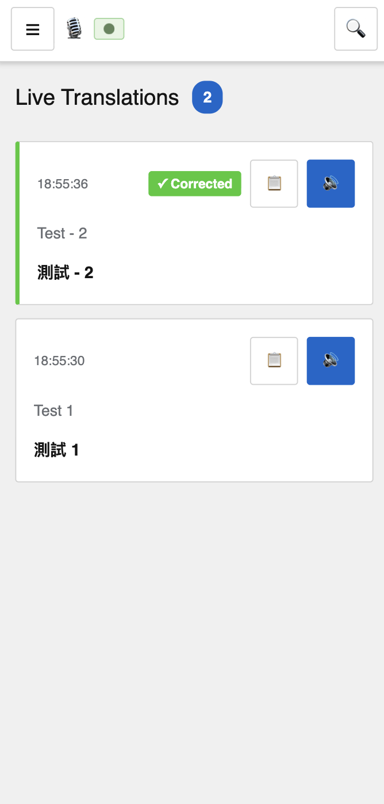
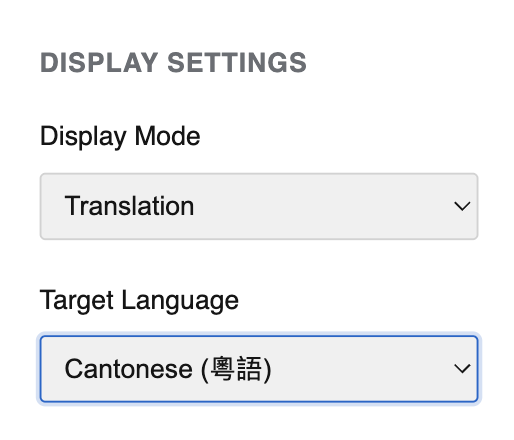
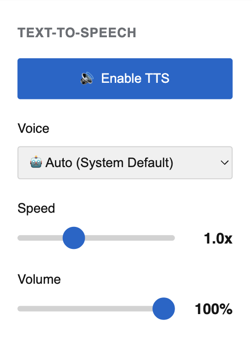
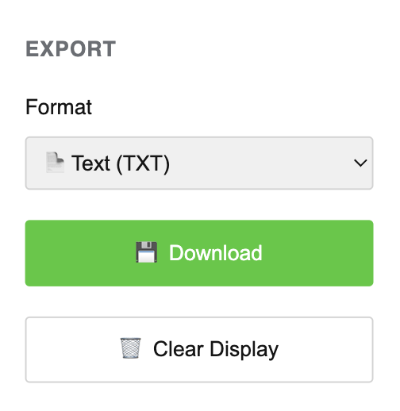

# EzySpeech - Viewer Guide

**Real-Time Translation Display for Audiences**

Welcome! This guide will help you view live translations during events and services.

---

## 📋 Table of Contents

- [What is EzySpeech?](#what-is-ezyspeech)
- [Getting Started](#getting-started)
- [Using the Viewer Interface](#using-the-viewer-interface)
- [Features](#features)
- [Keyboard Shortcuts](#keyboard-shortcuts)
- [Troubleshooting](#troubleshooting)
- [FAQ](#faq)

---

## What is EzySpeech?

EzySpeechTranslate provides real-time translation of live speech in multiple languages. Perfect for:

- ⛪️ Religious services and sermons
- 🎓 Educational lectures
- 💼 Business presentations
- 🎤 Conferences and events
- 🏥 Healthcare consultations

**What You Can Do:**

- View real-time translations in your language
- Listen to text-to-speech audio
- Download transcript after the event
- Choose from 20+ languages



---

## Getting Started

### Requirements

- **Any device**: Computer, tablet, or smartphone
- **Web browser**: Chrome, Firefox, Safari, or Edge
- **Internet connection**: Required for accessing the service

### Accessing the Service

1. **Get the URL** from event organizers
   
   - Typically: `https://your-domain.com:1915`
   - May be displayed on screen or shared via email/QR code

2. **Open in your browser**
   
   - Enter URL or scan QR code
   - No login required
   - No installation needed

3. **Select your language**
   
   - Choose from dropdown menu
   - Translations appear automatically

---

## Using the Viewer Interface

### Main Display

###### **What You See:**

- **Timestamp** - When it was spoken
- **The line, in your language** - the large text, which is what you read
- **What was actually said** - quieter, underneath, when it differs
- **Copy and play** - two buttons at the end of the row

**Layout:**

- Newest lines appear at the top
- Older lines move down
- Responsive design for any screen size
- The words appear as they are spoken, rather than a whole sentence at once

**When a verse is read**, the row shows the verse itself, looked up in a Bible
in your language and marked with which one, rather than a machine translation
of the words the speaker happened to use. If the speaker only mentioned a
passage in passing, the verse is offered on a quiet line underneath instead of
replacing what they said.

---

### Selecting Your Language



**Available Languages:**

| Language              | Language   |
| --------------------- |:----------:|
| Chinese (Simplified)  | Korean     |
| Chinese (Traditional) | Thai       |
| Chinese (Cantonese)   | Vietnamese |
| English               | Japanese   |
| Spanish               | Russian    |
| French                | Arabic     |
| German                | Hindi      |
| Italian               | Portuguese |
| Dutch                 | Indonesian |
| Polish                | Turkish    |

**To Change Language:**

1. Open the gear in the top right, or Language in the sidebar
2. Choose the language you want to read in
3. Everything updates at once — no reload
4. Choice is saved for next time

**One language, not two.** The language you choose is both the language the
speaker is translated into *and* the language of the buttons and headings. If
you would rather keep the page itself in English while reading translations in
another language, there is a "Keep the page in English" switch beside the
language list.

The first time you open the page a short wizard asks for this, and whether you
want the translations read aloud. Everything else is behind the gear.

---

## Features

### Text-to-Speech (TTS)



**Listen to translations:**

1. **Turn on "Read aloud"**

   - It is a switch in Settings → Text to speech, and an icon in the top bar.
     The icon shows a speaker when it is reading and a crossed-out speaker
     when it is not
   - New translations play automatically
   - **Hear a sample** plays the most recent line, so you can set the voice,
     the speed and the volume before the speaker starts rather than during

2. **Adjust Speed**
   
   - Use speed slider (0.5x - 2.0x)
   - Slower for comprehension
   - Faster to keep up with rapid speech
   - Default: 1.0x (normal speed)

3. **Control Volume**
   
   - Use volume slider (0% - 100%)
   - Adjust to comfortable level
   - Independent from device volume
   - Mute by setting to 0%

4. **Play Individual Items**
   
   - Click 🔊 button on any translation
   - Replays that specific translation
   - Works even with TTS disabled

**Tips:**

- 🎧 Use headphones in shared spaces
- 📱 Check device volume is not muted
- ⏸️ Disable TTS during Q&A or breaks

---

### Downloading Subtitles



**Save the transcript:**

1. **Click "Download Subtitles"** button
2. File saves to your device automatically
3. Formatted text file includes:
   - Timestamps
   - Original language text
   - Your language translation
   - Speaker information (if available)

**Use Cases:**

- Review content after event
- Share with others who missed it
- Study or reference material
- Archive for records

**File Format:**

```
[001] 18:55:30

      Original:
      Test 1

      Translation (YUE):
      測試 1

───────────────────────────────────────────────────────

[002] 18:55:36
      [✓ CORRECTED]

      Original:
      Test - 2

      Translation (YUE):
      測試 - 2
---
```

---

### Real-Time Updates

**How It Works:**

- ✅ Automatic connection to server
- ✅ Instant updates when speaker talks
- ✅ No refresh needed
- ✅ Smooth, continuous display

**Connection Status:**

- 🟢 **Green dot** - Connected and receiving
- 🟡 **Yellow dot** - Reconnecting...
- 🔴 **Red dot** - Disconnected (check internet)

---

### Display Modes

Settings → Display → Display mode.

**Translation** (default)

- The line in your language, large
- What was actually said, quieter underneath, when it differs

**Transcription**

- The speaker's own words only, as they are said, with nothing translated

Choosing the language the speaker is already using has the same effect as
transcription: there is nothing to translate, so the words simply appear.

---

### View Modes

Settings → View → View mode. These change the page, not the content.

**Standard** — the default.

**Accessibility** — larger reading text, every button at least 44 pixels
across, a heavier focus outline for anyone working by keyboard or switch.

**Elderly** — all of that, and the whole page a size up: labels, buttons and
settings, not only the line being read.

Font size has its own slider beside it, for adjusting the reading line alone.

---

### The Projection Screen

A separate page, `/projection`, for a screen at the front of the room. It is
not this page made bigger: it shows the line being said now and the two before
it, in one language, typed as the words arrive, and never scrolls.

The first time it opens it asks which room to follow, which language to show,
and whether the room is dark. It remembers the answers, so a projector that
loses power comes back to the same service. Pressing `s`, or the gear beside
the clock, asks again.

Full guide: [README_PROJECTION.md](README_PROJECTION.md).

---

## Keyboard Shortcuts

| Key   | What it does                          |
| ----- | ------------------------------------- |
| `/`   | Open the search and put the caret in it |
| `g`   | Back to the newest line               |
| `?`   | The full list of shortcuts            |
| `Esc` | Close whatever is open                |

On the projection screen, `s` opens its setup.

---

## Troubleshooting

### No Translations Appearing

**Problem:** Screen is blank or frozen

**Solutions:**

1. ✅ **Check connection status** (top right corner)
   
   - Look for green connected indicator
   - If red/yellow, check your internet

2. ✅ **Refresh the page** (reload button)
   
   - Reconnects to server
   - Should restore translation feed

3. ✅ **Verify event is active**
   
   - Admin must start recording first
   - Check with event organizers

4. ✅ **Try different browser**
   
   - Chrome, Firefox, Edge, or Safari
   - Clear cache if problems persist

---

### Translations Are Wrong

**Problem:** Translation doesn't make sense

**Possible Reasons:**

- Source transcription was incorrect
  
  - Admin will correct important errors
  - Corrected versions update automatically

- Internet translation service issue
  
  - Usually resolves quickly
  - Try refreshing page

- Language mismatch
  
  - Verify correct language selected
  - Some languages have multiple variants

**What to Do:**

- ✅ Wait for admin corrections (they appear automatically)
- ✅ Use context to understand meaning
- ✅ Check selected language is correct
- ✅ Download transcript to review later

---

### Audio Not Playing

**Problem:** TTS doesn't work or no sound

**Solutions:**

1. ✅ **Check device volume**
   
   - Not muted
   - Volume turned up
   - Try playing other audio

2. ✅ **Browser permissions**
   
   - Allow audio autoplay for this site
   - Check browser settings

3. ✅ **Volume slider in app**
   
   - Make sure not set to 0%
   - Try increasing volume

4. ✅ **Test with manual play**
   
   - Click 🔊 on individual translation
   - If that works, TTS is functioning

5. ✅ **Try different browser**
   
   - Some browsers better for TTS
   - Chrome/Edge recommended

---

### Page Loads Slowly

**Problem:** Translations lag or delay

**Solutions:**

- ✅ **Check internet speed**
  
  - Requires stable connection
  - Use WiFi instead of cellular if possible

- ✅ **Close other tabs/apps**
  
  - Free up device resources
  - Reduce network usage

- ✅ **Refresh the page**
  
  - Clears accumulated data
  - Establishes fresh connection

- ✅ **Move closer to WiFi**
  
  - Improve signal strength
  - Reduce interference

---

### Can't Download Subtitles

**Problem:** Download button doesn't work

**Solutions:**

1. ✅ **Check browser permissions**
   
   - Allow downloads for this site
   - Check downloads folder

2. ✅ **Try different browser**
   
   - Chrome/Edge recommended

3. ✅ **Disable popup blocker**
   
   - May prevent download
   - Allow for this site

4. ✅ **Take screenshot as backup**
   
   - Capture important content
   - Manual backup option

---

## FAQ

### Do I need to create an account?

**No.** The viewer interface requires no login or registration. Just open the URL and select your language.

---

### How many languages are supported?

**20+ languages** including Chinese (Simplified, Traditional, Cantonese), English, Spanish, French, German, Italian, Japanese, Korean, Arabic, Hindi, and more.

---

### Can I use this on my phone?

**Yes!** The interface is fully responsive and works on:

- 📱 Smartphones (iOS/Android)
- 📱 Tablets (iPad/Android)
- 💻 Laptops and desktops
- 🖥️ Any device with a web browser

---

### Is my data private?

**Yes.** This is a local viewing session. Your language selection and settings are stored only on your device. No personal information is collected.

---

### Does this work offline?

**No.** Internet connection required for:

- Receiving real-time translations
- Translation processing
- Text-to-speech synthesis

---

### Can I switch languages during the event?

**Yes!** Change language anytime:

- Select from dropdown menu
- All past translations re-translate automatically
- No interruption to service

---

### What happens if I lose connection?

The system will attempt to reconnect automatically:

- Yellow indicator shows reconnecting
- Green indicator when restored
- Translations resume from where you left off

If reconnection fails:

- Refresh the page
- Check your internet connection
- Contact event staff if problem persists

---

### Can I go back to see earlier translations?

**Yes!** Scroll down to view older translations. The interface keeps full history during the session.

---

### Why are some translations corrected?

Admins monitor the transcriptions and fix:

- Misrecognized words
- Proper names
- Technical terms
- Grammar improvements

When corrections are made, your translation updates automatically to reflect the accurate source text.

---

### Can I adjust text size?

**Yes!** Simply find the font size slider in the settings and adjust it to change the font size.

---

## Tips for Best Experience

### Before the Event

- [ ] Test the URL beforehand
- [ ] Select and verify your language
- [ ] Test TTS audio levels
- [ ] Ensure stable internet connection
- [ ] Charge device if mobile
- [ ] Use headphones in shared spaces

### During the Event

- [ ] Stay connected to WiFi
- [ ] Adjust text size for comfortable reading
- [ ] Enable TTS if you prefer audio
- [ ] Take notes if needed (download later)

### After the Event

- [ ] Download subtitles before leaving (if needed)
- [ ] Save file to desired location
- [ ] Share feedback with organizers
- [ ] Report any issues encountered

---

## Quick Reference

### Common Actions

| What You Want       | How To Do It                                 |
| ------------------- | -------------------------------------------- |
| Change language     | Click language dropdown, select new language |
| Play audio          | Enable TTS or click 🔊 on translation        |
| Adjust speed        | Move speed slider (0.5x - 2.0x)              |
| Change volume       | Move volume slider (0% - 100%)               |
| Download transcript | Click "Download Subtitles" button            |
| Scroll to older     | Scroll down in translation area              |

---

## Contact & Support

**Need Help?**

- Ask event staff or organizers
- They can assist with technical issues
- Contact IT support if provided

**Feedback:**

- Share your experience with organizers
- Report bugs or issues
- Suggest improvements

---

**Enjoy seamless multilingual communication!**

*Last Updated: December 2025 | Version 3.3.0*
